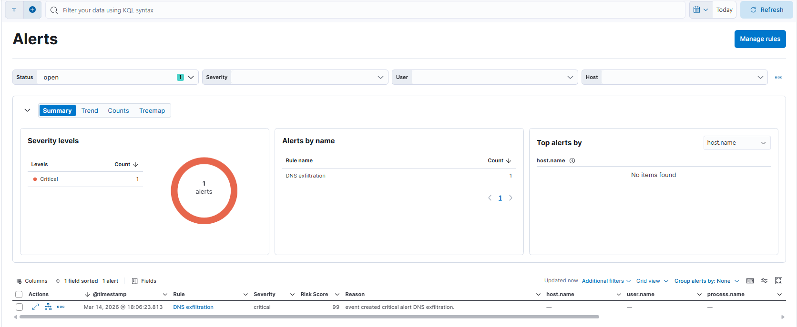

# End-to-End SOC: Real-time Threat Hunting, Detection & Automated Response

## Project Overview

In the modern cybersecurity landscape, organizations face an exponential increase in sophisticated threats, leading to severe overload in Security Operations Centers (SOC). This project, "End-to-End SOC Architecture", is designed to bridge the gap between academic theory and practical operational capability. 

The core value proposition of this repository is a fully functional, reproducible laboratory environment that covers the entire security data lifecycle. It encompasses raw log ingestion, advanced detection engineering, and automated incident response (SOAR playbooks). By combining open-source tools and scalable log analysis platforms, this ecosystem simulates a complete, enterprise-grade defense architecture.

## System Architecture & Data Flow

The architecture follows a layered design, ensuring data integrity from network and endpoint sensors down to the analysis and response engines.

| Architecture Layer | Applied Technologies | Core Role & Function |
| :--- | :--- | :--- |
| **Network Analysis** | Zeek, Suricata | Network traffic analysis, metadata extraction, signature-based threat matching. |
| **Endpoint** | OSQuery, Sysmon, Winlogbeat | Process monitoring, system events, SQL-based state querying, local firewall management. |
| **Data Pipeline** | Filebeat, Logstash, Elastic Fleet | Data collection, routing, Grok parsing, mapping to Elastic Common Schema (ECS). |
| **SIEM / Analysis** | Elasticsearch | Indexing, full-text search, data aggregation, machine learning API provider. |
| **Visualization** | Kibana | Dashboards, host risk heatmaps, incident timeline tracking. |

### Infrastructure as Code (IaC)
The entire infrastructure is containerized and provisioned using Docker Compose (`infra/docker-compose.yml`). The environment mounts local directories (like `pcap_to_process/`) directly into the sensors. Network traffic (PCAPs) or Windows Event Logs (EVTX) placed in these directories are automatically ingested, parsed by Zeek/Suricata, routed through Logstash (`infra/pipeline/logstash.conf`), and indexed into Elasticsearch.

---

## Detection Engineering

This project implements a layered detection strategy. Currently, 4 out of 5 advanced detection rules have been implemented, ranging from static signatures to machine learning and mathematical anomaly detection.

### 1. Signature Alert & Enrichment (Implemented)
Leverages Suricata as an Intrusion Detection System (IDS) to match malicious packets against known signatures. Scripts like `watch_dog_rule.py` and configurations like `ti_feed.yml` monitor the logs to detect and flag known indicators of compromise, elevating their severity.

### 2. Suspicious Parent-Child Process Chain (Implemented)
**Rule File:** `configs/rules/parent_child_process.yml`
Modern malware often uses "Living off the Land" techniques. This rule targets MITRE ATT&CK T1059.001 by analyzing process creation events from Windows Sysmon (via Winlogbeat). It triggers an alert when a process like `rundll32.exe` unexpectedly spawns an interpreter like `powershell.exe`.

### 3. Unusual Authentication Spike via Isolation Forest (Implemented)
**Scripts:** `infra/ml_login_anomaly.py`, `infra/fake_bruteforce.py`
Instead of static thresholds for Brute-Force or Credential Stuffing attacks (T1110), this detection utilizes the Isolation Forest machine learning algorithm. It is an unsupervised model that isolates anomalous authentication spikes dynamically based on path length, effectively filtering out normal business noise and significantly reducing false positives.

### 4. Data Exfiltration via DNS Tunneling (Implemented)
**Rule File:** `configs/rules/dns_tunneling.yml`
Attackers often bypass firewalls by encoding stolen data into subdomains of DNS queries (T1071.004). This rule parses Zeek's `dns.log` and applies statistical thresholds:
* **Length Anomaly:** Flagging queries exceeding standard character limits.
* **Shannon Entropy:** Calculating the mathematical randomness of the subdomain string to identify Base32/Base64 encoded data payloads.

### 5. C2 Beaconing Periodicity via Autocorrelation (Work in Progress)
**Intent:** Malware maintains communication with Command and Control (C2) servers using periodic packets. To defeat attackers who introduce randomized delays (jitter), this rule will use time-series analysis via Autocorrelation and Median Absolute Deviation (MAD) to find hidden periodic communication patterns.

---

## Security Orchestration, Automation, and Response (SOAR)

To minimize Mean Time To Respond (MTTR), the project utilizes automated playbooks written in Python to act on SIEM alerts without manual intervention.

### Playbook 1: Automated Data Enrichment (Work in Progress)
**Intent:** When an alert containing an external IP or URL is generated, a script will automatically extract the indicator and query Threat Intelligence platforms (like MISP or WHOIS) via REST APIs. The resulting context (malicious score, threat actor association) will be appended to the ticket.

### Playbook 2: Target Containment (Partially Implemented)
**Scripts:** `infra/auto_ban.py`
**Intent:** Once a critical alert is validated, this playbook interacts with the target endpoint's local firewall (via OSQuery extensions, `netsh` on Windows, or `iptables` on Linux) to isolate the machine from the network, stopping lateral movement instantly.

### Playbook 3: Ticketing & Case Management (Work in Progress)
**Intent:** To maintain documentation, a final Python script will format the incident data (MITRE techniques, affected hosts, timestamps, enrichment data) into a JSON payload and automatically create an issue on GitHub or Jira for the Incident Response team.

---

## Validation Harness & Performance Metrics (Work in Progress)

**Intent:** Following the "Detection-as-Code" paradigm, a testing framework using `pytest` will be implemented. When a malicious PCAP is replayed, the script will query Elasticsearch to verify if the correct alert was triggered. 
The results will be mapped to a Confusion Matrix (True Positives, False Positives, False Negatives, True Negatives) to calculate:
* **Precision:** Ensuring alerts are genuine threats.
* **Recall:** Ensuring no attacks are missed.
* **F1-Score:** The harmonic mean to prove the tuning quality of the rules and reduce Alert Fatigue.

---

## Dashboards & Visualization

The Kibana instance is configured to present the entirety of the SOC's intelligence on unified dashboards. Key visual components include:
* **Incident View & Timeline:** Spikes in log volume versus alert generation.
* **Host Risk Heatmap:** Ranking internal assets based on the frequency and severity of alerts.
* **Rule Performance:** Tracking rule efficacy over time.

*(Screenshots of current dashboard progress)*

---

## Repository Structure

* `configs/rules/`: YAML configuration files for the detection rules (Sigma/Elastic syntax).
* `infra/`: Contains the `docker-compose.yml`, setup scripts, ML models, and Winlogbeat configurations.
* `infra/pipeline/`: Logstash configuration files for Grok parsing and ECS mapping.
* `pcap_to_process/`: Dropzone for PCAP and EVTX files. Zeek and Suricata will automatically parse files placed here.
* `suricata_logs/`, `zeek_logs/`, `windows_logs/`: Output directories for generated telemetry.
* `Img_documentation/`: Project screenshots and architectural diagrams.

## How to Run

1. Navigate to the `infra` directory.
2. Execute `docker-compose up -d` to provision the ELK stack, Zeek, and Suricata.
3. Drop sample `.pcap` or `.evtx` files into the `pcap_to_process/` directory.
4. Access Kibana at `http://localhost:5601` to view the ingested logs, applied rules, and triggered alerts.
5. Custom Python scripts (e.g., `watch_dog_rule.py`, `ml_login_anomaly.py`) can be executed locally to monitor the indices and apply active response.
6. auto.sh: Execute ./auto.sh <traffic.pcap> to sequentially run Suricata signature scanning, automated IP banning, and Zeek metadata extraction.
7. winlogbeat: Deploy on Windows using .\winlogbeat.exe -c winlogbeat.yml -e to stream System, Security, and Sysmon event logs to the SOC pipeline.

## Acknowledgments & Credits

This laboratory environment and its validation harness heavily rely on the incredible resources shared by the open-source cybersecurity community. I would like to credit and express my gratitude to the following sources for providing the datasets used in simulating attacks and testing detection rules:

* **PCAP Datasets:** https://github.com/gubertoli/ProbingDataset/tree/v1.0.0
* **Windows Event Logs (EVTX):**  https://github.com/sbousseaden/EVTX-ATTACK-SAMPLES

*Note: All malicious datasets and network simulations are strictly isolated within the containerized lab environment for educational and research purposes.*
